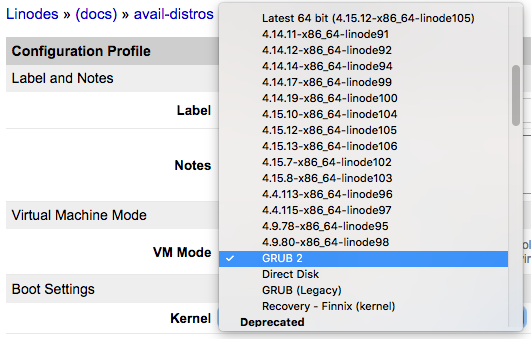

---
author:
  name: Linode
  email: docs@linode.com
description: "Use the Linode Manager to change which kernel your Linode boots."
keywords: ["kernel", "grub"]
license: '[CC BY-ND 4.0](http://creativecommons.org/licenses/by-nd/4.0/)'
aliases: ['run-a-distribution-supplied-kernel-with-kvm/','tools-reference/custom-kernels-distros/run-a-distribution-supplied-kernel/','tools-reference/custom-kernels-distros/run-a-distribution-supplied-kernel-with-kvm/']
modified: 2018-08-09
modified_by:
  name: Linode
published: 2015-06-29
title: 'Switching Your Linode's Kernel'
---

<!---->

Your Linode is capable of using your choice of the upstream kernel provided by a Linux distribution's maintainers, Linode's own kernel, or one which you've compiled yourself. Most distributions boot the upstream-supplied kernel by default, with exception to CentOS 6, OpenSUSE Leap 42.3, Slackware, and Ubuntu 14.04, which boot the Linode kernel by default.

This guide demonstrates using the Linode Manager to change which kernel a KVM-based Linode will boot.

1.  Shut down your Linode from the Linode Manager.

1.  Click **Edit** to view a distribution's configuration profile options:

    

1.  Under **Boot Settings** is a **Kernel** dropdown menu. Depending on your distribution, this will be set to either `GRUB 2` or `Latest 64 bit (<kernel version>-x86_64-linode)`.

    

1.  To change to the distribution's default kernel, select `GRUB 2` from the kernel menu. To use Linode's kernel, select `Latest 64 bit (<kernel version>-x86_64-linode)`. If instead you've installed your own kernel into your distribution, select that. See our guides on custom compiled kernels for [Debian, Ubuntu,](/docs/tools-reference/custom-kernels-distros/custom-compiled-kernel-debian-ubuntu/) and [CentOS](/docs/tools-reference/custom-kernels-distros/custom-compiled-kernel-centos-7/) more information.

    

1.  Click **Save Changes** at the bottom of the page and reboot into the new kernel.

1.  Once booted, you can verify the kernel information with `uname`:

        [root@archlinux ~]# uname -r
        4.15.14-1-ARCH

    You can switch back at any time by repeating the steps above for the kernel of your choice.

## Caveats

### SELinux

CentOS 7 and Fedora ship with SELinux running in enforcing mode by default. When switching from the Linode kernel to the distribution's kernel, SELinux may need to run a relabeling of the filesystem to boot. When completed, the Linode will reboot and if you have Lassie enabled, you'll be back at the login prompt shortly. If you do not have Lassie enabled, you will need to manually reboot from the Linode Manager.

The relabel process is triggered by the empty `/.autorelabel` file.

    [root@li901-254 ~]# ls -a /
    .   .autorelabel  boot  etc   lib    lost+found  mnt  proc  run   srv  tmp  var
    ..  bin           dev   home  lib64  media       opt  root  sbin  sys  usr

### No Upstream Kernel Installed

If your system does not boot and instead shows a Grub command line prompt in Lish like shown below, then you need to install the kernel and configure Grub. **This should only be necessary on Linodes which were created before February 2017.**

### Install the Kernel

1.  Update your system.

1.  Install the Linux kernel and Grub. Choose `/dev/sda` if you're asked which disk to install to during installation. Linode provides the Grub bootloader so your system only needs to provide a `grub.cfg` file.

    **Arch Linux**

        pacman -S linux grub

    **CentOS**

        yum install kernel grub2

    **Debian**

        apt-get install linux-image-amd64 grub2

    **Gentoo**

    There are two main ways to install Gentoo's kernel: Manual configuration and using the `genkernel` tool. Which you use and how you configure the kernel will depend on your preferences, so see the [Gentoo Handbook](https://wiki.gentoo.org/wiki/Handbook:AMD64/Installation/Kernel) for instructions.

    **Ubuntu**

        apt install linux-image grub2

When the installation finishes, you'll then see the kernel and other components in the `/boot` directory. For example:

    [root@archlinux ~]# ls /boot
    grub  initramfs-linux-fallback.img  initramfs-linux.img  vmlinuz-linux

#### Configure Grub

After the kernel is installed, you'll need to configure the serial console and other Grub settings so you can use [Lish](/docs/platform/manager/using-the-linode-shell-lish/) and [Glish](/docs/platform/manager/using-the-linode-graphical-shell-glish/).

1.  Open `/etc/default/grub` in a text editor and go to the line beginning with `GRUB_CMDLINE_LINUX`. Remove the word `quiet` if present, and add `console=ttyS0,19200n8 net.ifnames=0`. Leave the other entries in the line. For example, on CentOS 7 you should have something similar to:

        GRUB_CMDLINE_LINUX="crashkernel=auto rhgb console=ttyS0,19200n8 net.ifnames=0"

1.  Then add or change the following options to match the following example. There will be other variables in this file, but we are only concerned with these lines.

    
GRUB_TERMINAL=serial
GRUB_DISABLE_OS_PROBER=true
GRUB_SERIAL_COMMAND="serial --speed=19200 --unit=0 --word=8 --parity=no --stop=1"
GRUB_DISABLE_LINUX_UUID=true
GRUB_GFXPAYLOAD_LINUX=text



1.  Run the following command to prepare and update the bootloader:

    **Arch and Gentoo**

        grub-mkconfig -o /boot/grub/grub.cfg

    **CentOS**

    The .autorelabel file is necessary to queue the SELinux filesystem relabeling process when rebooting from the Linode kernel to the CentOS kernel.

        mkdir /boot/grub
        ln -s /boot/grub2/grub.cfg /boot/grub/grub.cfg
        grub2-mkconfig -o /boot/grub/grub.cfg
        touch /.autorelabel

    **Debian and Ubuntu**

        update-grub
