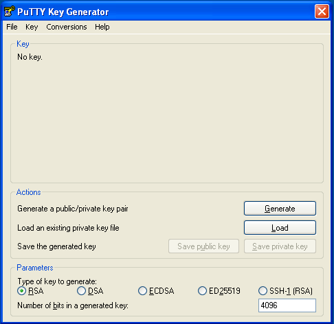
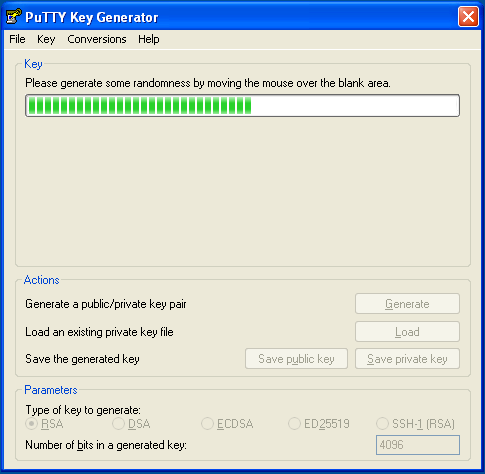
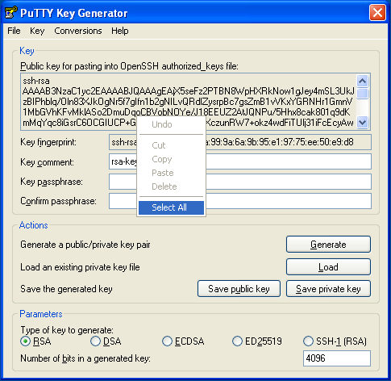
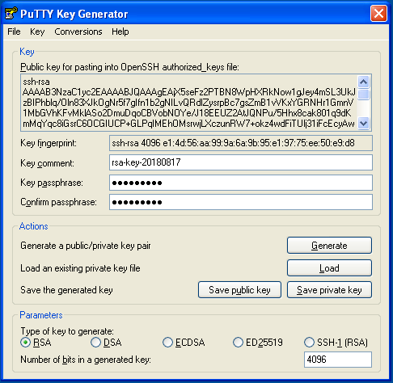
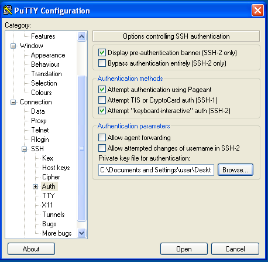

---
author:
  name: Linode
  email: docs@linode.com
description: 'Access your Linode via SSH using public Kkey authentication.'
keywords: ["ssh", "public key"]
license: '[CC BY-ND 4.0](https://creativecommons.org/licenses/by-nd/4.0)'
aliases: ['security/ssh-keys/', 'tools-reference/ssh/use-public-key-authentication-with-ssh/','security/use-public-key-authentication-with-ssh/','security/authentication/use-public-key-authentication-with-ssh/']
modified: 2018-08-17
modified_by:
  name: Linode
published: 2011-04-05
title: Use Public Key Authentication with SSH
---

Password authentication is the default method which most SSH clients use to authenticate with remote servers, but [public key authentication](https://en.wikipedia.org/wiki/Key_authentication#Authentication_using_Public_Key_Cryptography) has the benefit of convenience and increased security. An SSH keypair consists of a private and a public key, usually an RSA pair. The public key is added to servers you wish to connect to and the private key should be secured on your local machine with strict access rules.

A private key can be encrypted when generated so only individuals with the decryption password will be able to use the key, even if the keypair itself becomes compromised. A password is only used to unlock the private key locally and is not transmitted to the remote host. For added convenience, and depending on your local workstation's security, you can add a private key's decryption password to your local keychain so it's saved after the first login.

## Linux / macOS

### Generate a Keypair

1.  **These next two steps are done on your Linode or other remote machine.** During creation, you will be given the option to encrypt the private key with a passphrase; we suggest you do so. This means that it cannot be used without entering that passphrase, unless you save it to your local machine's keychain manager. We suggest you use the keypair with a passphrase but you can leave this field blank if you don't want to use one.

    
If you've already created an RSA keypair on this computer at some previous point, this command will overwrite it, potentially locking you out of other systems. If you've already created a keypair, skip this step. To check for existing keys, run `ls ~/.ssh/id_rsa*`.

If you accidentally lock yourself out of your Linode, use [Lish](/docs/networking/using-the-linode-shell-lish) to update your `authorized_keys` file and regain SSH access.


        ssh-keygen -b 4096

1.  Press **Enter** to use the default names `id_rsa` and `id_rsa.pub` in `/home/your_username/.ssh` before entering your passphrase.

        user@linode: ssh-keygen -b 4096
        Generating public/private rsa key pair.
        Enter file in which to save the key (/home/user/.ssh/id_rsa):
        Enter passphrase (empty for no passphrase):
        Enter same passphrase again:
        Your identification has been saved in /home/user/.ssh/id_rsa.
        Your public key has been saved in /home/user/.ssh/id_rsa.pub.
        The key fingerprint is:
        f6:61:a8:27:35:cf:4c:6d:13:22:70:cf:4c:c8:a0:23 user@linode

### Upload Your Keypair

1.  **These next two steps are done on your Linode or other remote machine.** Log in as the user who will be using the keypair. Substitute your own SSH user and host name or IP address below.

        ssh user@example.com

1.  Create the `.ssh` directory and `authorized_keys` file if they don't already exist on the remote server:

        mkdir ~/.ssh && touch ~/.ssh/authorized_keys
        chmod 700 ~/.ssh && chmod 600 ~/.ssh/authorized_keys

1.  **Now on your local machine again**, add the public key to the remote server's `authorized_keys` file:

        scp ~/.ssh/id_rsa.pub example_user@203.0.113.10:~/.ssh/authorized_keys

### Connect to the Remote Server

1.  SSH into the server from your local machine:

        ssh user@example.com

1.  Depending on your desktop environment, a window may appear prompting you for the private key's password you assigned earlier when creating the keypair.

    

    
Do not allow the local machine to remember the password in its keychain unless you are on a private computer which you trust.


1.  Click **OK** and you should see the connection establish in the local terminal.

## Windows

### Generate and Upload a Keypair with PuTTY

1.  Download PuTTYgen (`puttygen.exe`) and PuTTY (`putty.exe`) from the [official site](http://www.chiark.greenend.org.uk/~sgtatham/putty/download.html).

1. Launch `puttygen.exe`. The `RSA` key type at the bottom of the window is selected by default for an [RSA](https://en.wikipedia.org/wiki/RSA_(cryptosystem)) keypair but `ED25519` ([EdDSA](https://en.wikipedia.org/wiki/EdDSA) using [Curve25519](https://en.wikipedia.org/wiki/Curve25519)) is a comparable option if your remote machine's SSH server supports DSA signatures. Do not use the `SSH-1(RSA)` key type unless you know what you're doing.

    Increase the RSA key size from 2048 bits 4096 and click **Generate**.

    

1.  PuTTY uses the random input from your mouse to generate a unique key. Once key generation begins, keep moving your mouse until the progress bar is filled.

    

1.  When finished, PuTTY will display the new public key. Right-click on it and select **Select All**, then copy the public key into a Notepad file.

    

1.  **Save the public key as a `.txt` file** or some other plaintext format. **This is important**--a rich text format such as `.rtf` or `.doc` can add extra formatting characters and then your private key won't work.

    

1.  Enter a passphrase for the private key in the **Key passphrase** and **Confirm passphrase** text fields. **Important:** Make a note of your passphrase, you'll need it later.

    

1.  Click **Save private key**. Choose a file name and location in Explorer while keeping the `ppk` file extension. If you plan to create multiple keypairs for different servers, be sure to name them differently so you don't overwrite old keys with new.

    

### Connect to the Remote Server

1.  Launch `putty.exe`. Find the **Connection** tree in the Category window, expand **SSH** and select **Auth**. Click **Browse** and navigate to the private key you created above.

    

1.  Scroll back to the top of the Category window click **Session**. Enter the hostname or IP address of your Linode. TCP port `22` is the IANA assigned port for for SSH traffic so that is PuTTY's default; change it if your server is listening on a different port. Name the session in the **Saved Sessions** text bar and click **Save**.

    

1.  Click the **Open** button to establish a connection. You will be prompted to enter a login name and password for the remote server.

1.  Once you're logged in to the remote server, configure it to authenticate with your SSH keypair instead a user's 'password. Create an `.ssh` directory in your home directory on your Linode, create a blank `authorized_keys` file inside, and set their access permissions.

        mkdir ~/.ssh && touch ~/.ssh/authorized_keys
        chmod 700 ~/.ssh && chmod 600 ~/.ssh/authorized_keys

1.  Copy the public key from your local workstation to the `authorized_keys` file on your Linode. When copying from the public key file exported from PuTTY, only select the key as shown below.

1.  Exit PuTTY, then reconnect and **Load** your saved session. You'll be prompted to enter your Linode user's login name as before. However, this time you will be prompted for your private SSH key's passphrase rather then your Linode user's password. Enter the passphrase and press *Enter*.

### Using WinSCP

Uploading a public key from Windows can also be done using [WinSCP](http://winscp.net/).

1.  In the login window, enter your Linode's public IP address as the hostname and your non-root username and password. Click *Login* to connect.

1.  Once connected, WinSCP will show two file tree sections. The left shows files on your local computer and the right shows files on your Linode. Using the file explorer on the left, navigate to the file where you saved your public key in Windows. Select the public key file and click *Upload* in the toolbar above.

1.  You'll be prompted to enter a path on your Linode where you want to upload the file. Upload the file to `/home/example_user/.ssh/authorized_keys`, replacing `example_user` with your username.
